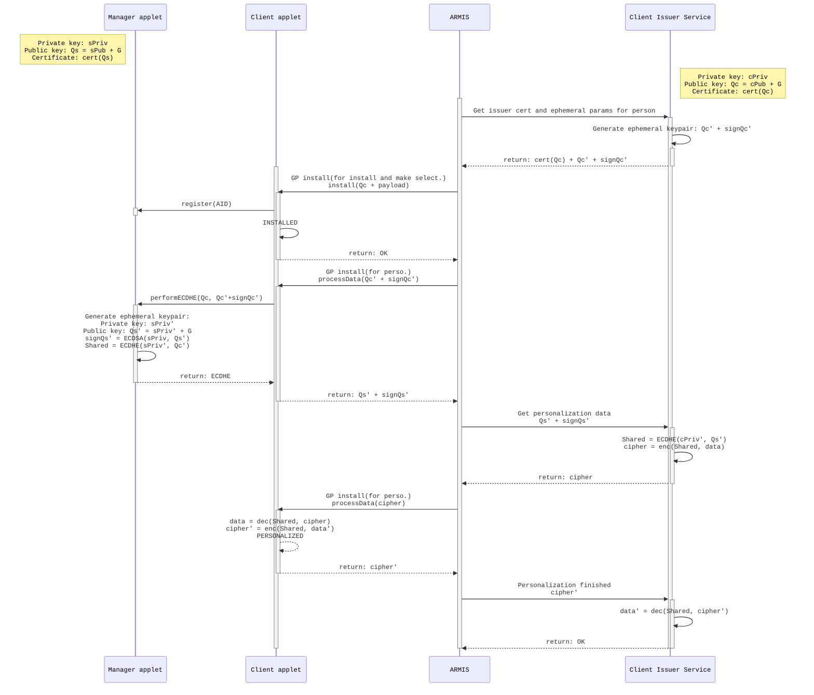
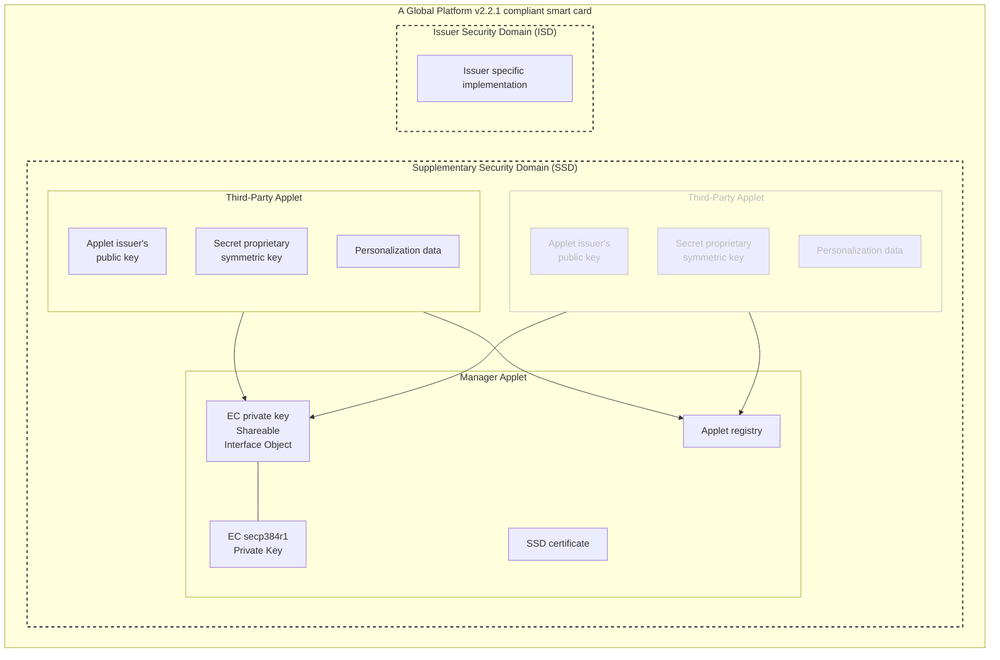

# ARMIS Applet Ecosystem

ARMIS ecosystem for Estonian ID cards.

## Table of Contents
- [Related repositories](#related-repositories)
- [Project structure](#project-structure)
- [Building the project](#building)
- [Applet lifecycle](#lifecycle)
- [Testing the applet lifecycle](#testing)
- [Applet developing process](#applet-development)

<a id="related-repositories"></a>
## Related repositories
- [Client Issuer Service](https://github.com/open-eid/armis-test-client-issuer-service)
- [ARMIS CLI applet management application](https://github.com/open-eid/armis-cli)

<a id="project-structure"></a>
## Project structure

* `ext/` - external tools and libraries:
  * `sdks/` - Oracle Java Card Classic development kit, included from [Martin Paljak's oracle_javacard_sdks](https://github.com/martinpaljak/oracle_javacard_sdks) as a Git submodule.
              This project is using version 3.0.4 (conforming to the specification for the Java Card 3 Platform, Version 3.0.4, Classic Edition)
  * `gp-exports` - Export files for GlobalPlatform APIs, included from [OpenJavaCard's globalplatform-exports](https://github.com/OpenJavaCard/globalplatform-exports) as a Git submodule.
                   This enables using the capabilities defined by the specification of the same name. This project is using version 1.6, located in directory `org.globalplatform-1.6`.
  * `ant-javacard.jar` - [Martin Paljak's Ant task for building Java Card applets](https://github.com/martinpaljak/ant-javacard). This is not included in the project, but will be downloaded automatically by the first `ant build`.
* `util-lib/` - [ARMIS Utilities Library](util-lib/README.md) used by ARMIS Manager Applet and potentially by issuer applets
  * `dist/` - destination directory for CAP, EXP and JAR files of the built Java Card package
  * `src/` - Java source files
  * `build.xml` - an [Ant](https://ant.apache.org/) build script for building the library using [`ant-javacard`](https://github.com/martinpaljak/ant-javacard)
* `manager/` [ARMIS Manager Applet](manager/README.md)
  * `dist/` - destination directory for CAP, EXP and JAR files of the built Java Card package
  * `src/` - Java source files
  * `build.xml` - an [Ant](https://ant.apache.org/) build script for building the applet using [`ant-javacard`](https://github.com/martinpaljak/ant-javacard)
* `test-client/` - [Example ARMIS Client Applet](test-client/README.md) that can be used to try out third party applet remote installation and personalization
  * `dist/` - destination directory for CAP, EXP and JAR files of the built Java Card package
  * `src/` - Java source files
  * `build.xml` - an [Ant](https://ant.apache.org/) build script for building the applet using [`ant-javacard`](https://github.com/martinpaljak/ant-javacard)
* `build.xml` - an [Ant](https://ant.apache.org/) build script that aggregates `build` and `clean` tasks of `util-lib/build.xml`, `manager/build.xml` and `test-client/build.xml` together for convenience

<a id="building"></a>
## Building the project

### Prerequisites
- Java 1.8 JDK
- Apache Ant

### Cloning JavaCard SDKs and GlobalPlatform's export files as Git submodules
```bash
git submodule update --init --recursive
```

### Building using Ant
```bash
ant {target-name}
```

Available targets:
- `clean` - delete the `dist` directories in all submodules and their contents
- `build` - build all submodules, overwriting their `dist` directories (if present)

You will find the built CAP files in their respective `dist` directories:
- Manager applet: `manager/dist/armis-ecosystem-manager.cap`
- Client applet: `test-client/dist/armis-test-client.cap`
- Utilities library: `util-lib/dist/armis-ecosystem-lib.cap`

<a id="lifecycle"></a>
## Applet lifecycle

The applet has exactly 3 lifecycle phases:

- INSTALLED
- PERSONALIZED
- (UNINSTALLED)

[Following diagram is generated using https://mermaid.js.org (supported by Github/IntelliJ)]: #


**NB:** Currently, the applet is installed via the Global Platform `install (for install and make selectable)` command
before its personalization takes place.
In a future revision, this is planned to be changed so that the initial installation will be performed via the
`install (for install)` command and the applet will be made selectable via the `install (for make selectable)` command
only after the personalization has finished successfully.

<a id="testing"></a>
## Testing the applet lifecycle

### Prerequisites
- You must have built the required CAP files, as explained in section [Building the project](#building).
- You must have a suitable smart card available which supports Java Card v3.0.4 Classic Edition and Global Platform v2.2.1.
  **NB**! You cannot use _live_ ID-cards for this! 
- You need to have SSD (Supplementary Security Domain) and DM (Delegated Management) keys available to use ARMIS management utility.

### Testing
- Insert the smart card to your computer
- Run [ARMIS Client Issuer Service](https://github.com/open-eid/armis-test-client-issuer-service). Note that the examples in the next step assume you are running it on `localhost:8080`.
- Download latest [ARMIS CLI applet management application](https://github.com/open-eid/armis-cli).
  - Use `manage` with `unload-all` step to remove all packages from a card. Example:
    ```sh
    java -jar /path/to/armis-cli.jar --armis.sd-key=file:ssd.key.hex --armis.dm-key=file:dm.key.pem --armis.action=manage --armis.steps[0]="unload-all"
    ```
    "Invalid TLV" errors are currently expected in this step and these should not affect the outcome.
  - Use `sign` commands to sign ARMIS Utilities Library, Manager Applet and Client Applet. Example:
    ```sh
    java -jar /path/to/armis-cli.jar --armis.sd-key=file:ssd.key.hex --armis.dm-key=file:dm.key.pem --armis.action=sign --armis.cap-in=file:util-lib/dist/armis-ecosystem-lib.cap --armis.cap-out=util-lib/dist/armis-ecosystem-lib-signed.cap
    java -jar /path/to/armis-cli.jar --armis.sd-key=file:ssd.key.hex --armis.dm-key=file:dm.key.pem --armis.action=sign --armis.cap-in=file:manager/dist/armis-ecosystem-manager.cap --armis.cap-out=manager/dist/armis-ecosystem-manager-signed.cap
    java -jar /path/to/armis-cli.jar --armis.sd-key=file:ssd.key.hex --armis.dm-key=file:dm.key.pem --armis.action=sign --armis.cap-in=file:test-client/dist/armis-test-client.cap --armis.cap-out=test-client/dist/armis-test-client-signed.cap
    ```
  - Use `deploy-manager` command to deploy the ARMIS Manager Applet onto a card. Example:
    ```sh
    java -jar /path/to/armis-cli.jar --armis.sd-key=file:ssd.key.hex --armis.dm-key=file:dm.key.pem --spring.profiles.active=gp-keys-local,ca-local --armis.action=deploy-manager --armis.manager-cap-file=file:manager/dist/armis-ecosystem-manager-signed.cap --armis.library-cap-file=file:util-lib/dist/armis-ecosystem-lib-signed.cap
    ```
  - Use `deploy-client` command to deploy the signed ARMIS Test Client Applet onto a card. Example:
    ```sh
    java -jar /path/to/armis-cli.jar --armis.sd-key=file:ssd.key.hex --armis.dm-key=file:dm.key.pem --armis.action=deploy-client --armis.client-cap-file=file:test-client/dist/armis-test-client-signed.cap --armis.issuer-url=http://localhost:8080/v1
    ```
  - Use `list` to list applets/packages present on a card. Example:
    ```sh
    java -jar /path/to/armis-cli.jar --armis.sd-key=file:ssd.key.hex --armis.dm-key=file:dm.key.pem --armis.action=list
    ```
  - Observe ARMIS CLI and ARMIS Client Issuer Service logs. If you have deployed the manager applet and a single client
    applet, you should see the following GP registry entries in ARMIS CLI logs:
    - `PKG: 41524D49532D6C6962 [LOADED]` - ARMIS Utility Library (package)
    - `PKG: 4D616E61676572 [LOADED]` - ARMIS Manager Applet (package)
    - `APP: 4D616E61676572417070 [SELECTABLE]` - ARMIS Manager Applet (application)
    - `PKG: 4D616E6167657241 [LOADED]` - ARMIS Test Client Applet (package)
    - `APP: 4D616E61676572417071 [SELECTABLE]` - ARMIS Test Client Applet (application)
    
    There might also be other entries depending on the type of your card. You can ignore these. 

<a id="applet-development"></a>
## Applet development

### Applet development requirements
- While developing the applet, follow the guidelines defined in
  [Java Card 3 Platform Programming Notes](https://docs.oracle.com/javacard/3.0.5/prognotes/toc.htm).
- Java Card is not Java. Fancy object-oriented designs lead to fat and slow applets, because of
  class / interface overhead in the CAP file and virtual method overhead at run time.
- The applet should extend `ee.openeid.armis.applet.ecosystem.libs.AbstractApplet`, not `javacard.framework.Applet` directly.
- The applet should be optimized so that it would use as little EEPROM as possible. This means that every object or array
  must be initialized during the applet installation.
- The applet should never persist any objects retrieved by the Sharable Interface Object. The instances provided by the
  SIO are transient and will be reset after [CLEAR_ON_RESET](https://docs.oracle.com/javacard/3.0.5/api/javacard/framework/JCSystem.html#CLEAR_ON_RESET).
  Therefore, the intended practice is to retrieve the security capable object every time it is needed. The ARMIS Applet Ecosystem invokes
  [`JCSystem.requestObjectDeletion()`](https://docs.oracle.com/javacard/3.0.5/api/javacard/framework/JCSystem.html#requestObjectDeletion())
  every time any object is requested from SIO.
- The Manager Applet has a vaulted EC private key that can be accessed through SIO provided cryptographic objects. The
  public part of the keypair is stored as a certificate on the card. The applet should not persist any additional private
  keys. Persisting additional public keys is allowed only if there is a strong business use case behind it.
- In addition to the contact interface, a card running the applet may also support a contactless interface. The contactless interface
  shall not expose any unique identification data that would make the card distinguishable among all the cards without
  performing a mutual authentication between the card and the host. For example, the applet can expose a purpose of the
  application, but it is not allowed to expose a serial number.
- The Applet shall ensure the integrity of the communication over the contactless interface. Integrity for the contact
  interface is optional.

### Applet development process

- Make sure you can deploy both ARMIS Manager Applet and Example ARMIS Client Applet to the card, as explained in
[Testing the applet lifecycle](#testing).
- Modify the test client applet as needed or create a new one from scratch.
- Compile the application as explained in section [Building the project](#building).
- Modify the Client Issuer Service as needed or create a new one from scratch.
- Follow the steps in [Testing the applet lifecycle](#testing) to test the application.

### Interfacing with the ARMIS applet ecosystem

#### Global Platform



All the operations to manage the card content is enabled by the Global Platform (GP) specification.
ARMIS has permission to operate in Supplementary Security Domain (SSD), which is separated from Issuer Security Domain
by firewall. SSD and ISD cannot directly interact with each other.
All the applet loading, installing, personalizing and removing operations are performed for the applet issuer by ARMIS.

#### Manager Applet

The [Manager Applet](manager/src/main/java/ee/openeid/armis/applet/ecosystem/ManagerApplet.java)
holds two purposes on the card.

1. Every third party applet on the card will have its own AID.
   The ecosystem doesn't know which applets are the third-party applets.
   The Manager Applet holds a
   [registry](util-lib/src/main/java/ee/openeid/armis/applet/ecosystem/libs/AppletRegistry.java)
   of currently installed third-party applets and their AIDs.
   During the applet installation and uninstallation, the third party applet uses the shareable interface provided by 
   the manager applet to notify it of its installation and uninstallation.
2. To optimize the memory usage and to enable communication integrity and confidentiality between the issuer.

##### EC keypair

During the personalization of the Manager Applet an EC keypair is generated, and a certificate is issued for its public
key by ARMIS.
The public key and the certificate are exposed to third-party applets and their personalization services for
identification purposes of the card holder.
The private key never leaves the Manager Applet.
The private key object cannot be accessed but can be used via SIO (*Shareable Interface Object*) interfaces.

The keypair generation can be executed by ARMIS during the personalization, but it is also possible after personalization.
The latter is required if the private key is somehow compromised.
This means that the keypair can potentially change during the lifecycle of ARMIS Applet Ecosystem.

#### Ecosystem library

The space on the card is very limited.
Also, the standards used by the applet developers are mostly common.
The Java Card API doesn't provide all the tools that would satisfy the third-party applet developers needs.
To reduce the need for additional custom code, ARMIS ecosystem library covers some of those needs.

Additionally, the library exposes the *Shareable Interface Objects* (SIO) that third-party libraries can interface with,
and an [AbstractApplet](util-lib/src/main/java/ee/openeid/armis/applet/ecosystem/libs/AbstractApplet.java)
class that third-party applets need to extend.
